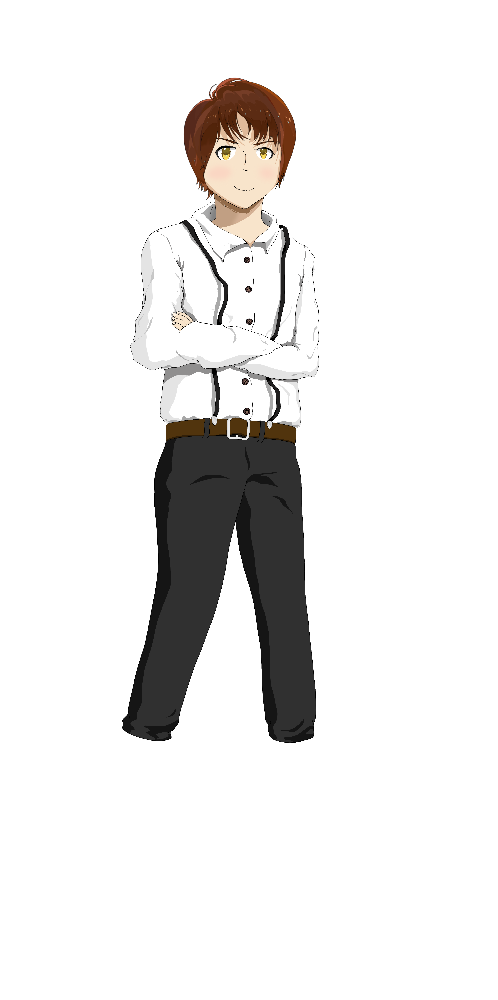

# 1、基础角色动画  
#### 使用: at + 动画函数名称  

扩张出现在中央：`at bs11`  

溶解出现在中央：`at s11`  
溶解出现(多个人)：`at s21`、`at s22` 等，最多支持四个人，即 `at s41`、`at s42`...  

从右侧溶解出现在中央：`at s11rl`  
从右侧溶解出现(多个人)：`at s21rl`、`at s22rl` 等，最多支持四个人，即 `at s41rl`、`at s42rl`...  

溶解出现在中央(近距离)：`at sb11`
溶解出现在中央(近距离、多个人)：`at sb21`、`at sb22` 等，最多支持四个人，即 `at sb41`、`at sb42`...  
从右侧溶解出现(近距离、多个人)：`at sb21rl`、`at sb22rl` 等，最多支持四个人，即 `at sb41rl`、`at sb42rl`...  

溶解出现在中央(远距离)：`at ss11`
溶解出现在中央(远距离、多个人)：`at ss21`、`at ss22` 等，最多支持四个人，即 `at ss41`、`at ss42`...  
从右侧溶解出现(远距离、多个人)：`at ss21rl`、`at ss22rl` 等，最多支持四个人，即 `at ss41rl`、`at ss42rl`...  

走到指定位置 `walk21`，最多支持四个人  

蹲下 `at nd`  
蹲下(近距离) `at ndb`  
蹲下(远距离) `at nds`  

站起 `at nu`  
站起(近距离) `at nub`  
站起(远距离) `at nus`  

跳跃 `at j`  
跳跃(近距离) `at jb`  
跳跃(远距离) `at js`  

点头 `at n`  
点头(近距离) `at nb`  
点头(远距离) `at ns`  

摇头 `at r`  
持续摇头(近距离) `at rr`  

放大隐藏 `at h`  
放大隐藏(近距离) `at hb`  
放大隐藏(远距离) `at hs`  

从右侧溶解隐藏 `at hrl`  
从右侧溶解隐藏(近距离) `at hbrl`  
从右侧溶解隐藏(远距离) `at hsrl`  

# 2、基础表情
#### 使用: show  
疑问 `show why11`，最多支持三个人  
汗 `show water11`，最多支持三个人  
混乱 `show emm11`，最多支持三个人  
慌张 `show rush11`，最多支持三个人  
惊讶 `show amaz11`，最多支持三个人  
高兴 `show happy11`，最多支持三个人  
愤怒 `show angry11`，最多支持三个人  
生气 `show steam11`，最多支持三个人  
微妙 `show sub11`，最多支持三个人  
哼歌 `show munote11`，最多支持三个人  

# 3、其他动画  
#### 使用: at + 动画函数名称  
闪烁 `flicker`  
较慢较浅的闪烁 `layerflicker`  
摇晃 `shake`  
头晕目眩 `dizzy(m=1, t=1.0, subpixel=True, k = 1)`  
m 摇晃幅度、t 摇晃速度、subpixel 使用子像素处理、k 垂直额外摇晃幅度  

# 4、转场  
#### 使用: with + 动画函数名称  
`close_eyes` 闭眼  
`open_eyes` 睁眼  
`push_left` 左侧推出  
`push_up` 上侧推出  
`clockwise` 顺时针  
`anticlockwise` 逆时针  
`close` 扩张  
`tran_close` 扩张变黑再扩张到新场景  
`tran_clockwise` 顺时针变黑再顺时针到新场景  
`tran_lf`、`tran_rf`、`tran_uf`、`tran_df` 从左、右、上、下侧溶解  
`tran_water`、`tran_light`、`tran_fog`、`tran_fast`、`tran_updown` 几种转场效果  

# 5、图像  
#### 使用: show + imgname
`black` 黑色  
`white` 白色  
`red` 红色  
`movietext` 电影效果  
`snow_white` 白色雪花  
`snow_yellow` 黄色光斑  
`snow_blood` 红色飚血  
`blood` 血  
`blood_thorn`、`blood_boom`、`blood_shed` 几种血效果  
`noise` 雪花屏  
`linework` 集中线  
`fastwork` 速度线  

# 6、特殊文本  
#### 用: show + 效果 + 文本  
`credits_text` 中间文本  
`credits_text_up` 中间文本偏上  
`credits_text_down` 中间文本偏下  
`credits_text_big` 中间大文本  


# 7、其他音轨  
音效 `second_sound`、`third_sound`  
音乐 `second_music`、`third_music`  

# 8、获得时间  
`getTime()`  

## 禁止选项回滚  
```Python
define config.rollback_enabled = False
```

## 强制自动存档  
```Python
$ renpy.force_autosave()
```

## 让Ren’Py重启，将用户带回到主菜单。  
```Python
$ renpy.full_restart(transition=False, label='_invoke_main_menu', target='_main_menu')
```

## 返回一个(x, y)元组，表示鼠标指针或当前触摸位置的坐标。  
```Python
$ renpy.get_mouse_pos()
```

## 返回物理窗口的尺寸。  
```Python
$ renpy.get_physical_size()
```

## 让Ren’Py暂停  
```Python
$ renpy.pause()
```

---
2月13日更新：
## lyh新表情系列。

一些规范：
- 以后每个角色单独在 `image` 文件夹下创建表情子文件夹，在 `character_image.rpy` 文件中声明时只须使用 `"<xxx>\<image>.png"` 即可。
- 因为图集中 愤怒，流汗 这两个属于附属表情(具体表现为怒气符号与生草汗滴)，所以我们将表情分为三个类别 `normal`、`angry`、`sweat`。命名方式则为在 `normal` 系列表情的命名尾部加上 `a` 表示愤怒(angry)，加上 `s` 表示流汗(sweat)。而 `normal` 状态下沿用初始命名，但是将 `lyh` 前缀删除。例如  

| `normal` | `angry` | `sweat` |
| ---- | ---- | ---- |
|  |  |  |
| `normal.png` | `normala.png` | `normals.png` |

- 将 `character_image.rpy`中声明的 `lyh happy` 从 `lyh normal.png` 改为一个新增表情 `happy.png`。

